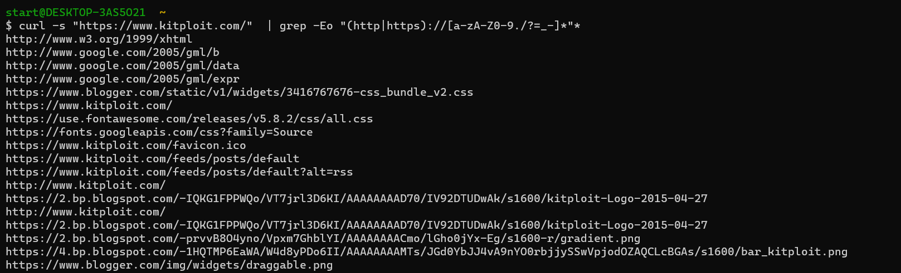

### 从文件中提起出网址
```
cat file | grep -Eo "(http|https)://[a-zA-Z0-9./?=_-]*"*
```



### 批量检测`.git`泄露

```
cat domains.txt | sed 's#$#/.git/HEAD#g' | while read host do ; do echo -en "$host --> " ;curl -I -m 10 -o /dev/null -s -w %{http_code} $host;e
cho ;done;
```

```
localhost:~# cat domains.txt
http://10.7.10.112:81
http://10.7.10.112:81
http://10.7.10.112:81
http://10.7.10.112:81
http://10.7.10.112:81
http://10.7.10.112:81
http://10.7.10.112:81
http://10.7.10.112:81
http://10.7.10.112:81
```

```
localhost:~# cat domains.txt | sed 's#$#/.git/HEAD#g' | while read host do ; do echo -en "$host --> " ;curl -I -m 10 -o /dev/null -s -w %{http_code} $host;e
cho ;done;
http://10.7.10.112:81/.git/HEAD --> 200
http://10.7.10.112:81/.git/HEAD --> 200
http://10.7.10.112:81/.git/HEAD --> 200
http://10.7.10.112:81/.git/HEAD --> 200
http://10.7.10.112:81/.git/HEAD --> 200
http://10.7.10.112:81/.git/HEAD --> 200
http://10.7.10.112:81/.git/HEAD --> 200
http://10.7.10.112:81/.git/HEAD --> 200
http://10.7.10.112:81/.git/HEAD --> 200
```

- -I 仅测试HTTP头
- -m 10 最多查询10s
- -o /dev/null 屏蔽原有输出信息
- -s silent 模式，不输出任何东西
- -w %{http_code} 控制额外输出

### 退出shell，但是不保存历史记录

```
kill -9 $$
unset HISTFILE && exit
```

### 条件语句判断

```
true && echo success
false || echo failed
```

### 静态http服务器

```
busybox httpd -p $PORT -h $HOME [-c httpd.conf]
```

### Python开启HTTP服务

```
# Python 3.x
python3 -m http.server 8000 --bind 127.0.0.1

# Python 2.x
python -m SimpleHTTPServer 8000
```


### Python编码解码Base64

```
python -m base64 -e <<< "sample string"   编码
python -m base64 -d <<< "dGhpcyBpcyBlbmNvZGVkCg=="   解码
```

### Google Hack 查找敏感信息

```
intitle:"Everything"  intext:"上一目录"
```

